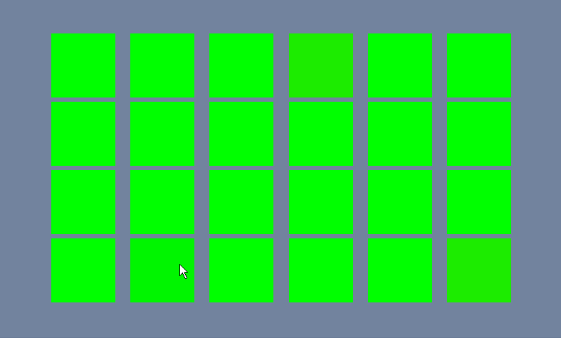

Concentration/Memory game

Written largely with ChatGPT (3) and GitHub Copilot as it's been ~2 years since I touched Unity.  Spent 90-120m on this.

- Launching game creates cards in random order
- There are no rules/game logic (yet) on selecting cards.
- Many things are lacking, such as card backs, proper scaling on larger displays, and restarting (you must quit & relaunch currently)

# Demo

